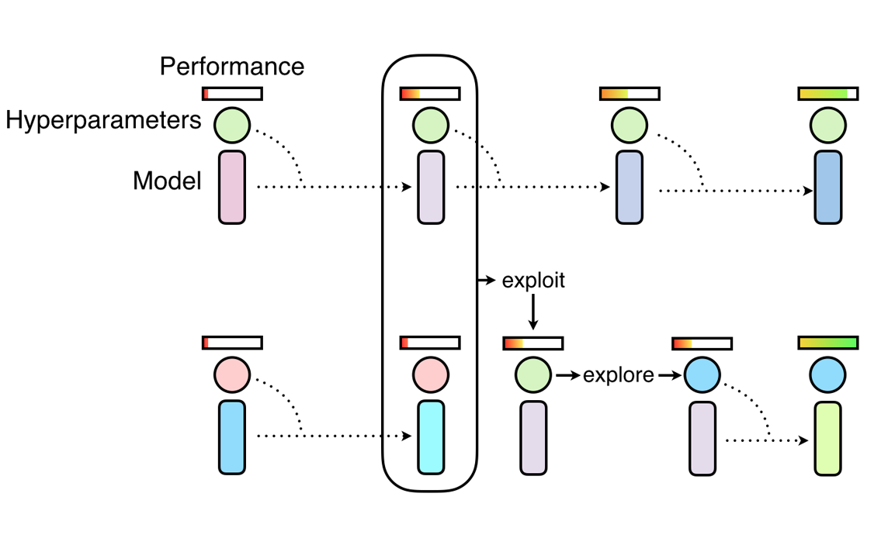

### IDATT2502 Project - Reinforcement Learning using Bio-inspired methods

#  Using Population-Based Training (PBT) for PPO agent vs baseline PPO agent 


For this research-project, we have combined the use of two separate repositories. One on Population Based Training (PBT), which is our bio-inspired method of choice, as well as one that only contains our algorithm of choice. This ReadMe-file covers both projects. 
Our algorithm of choice is Proximal Policy Optimization (PPO), a policy gradient method that has proven to function well, but is sensitive to hyperparameter-tuning. Thus, using a hyperparameter-tuning optimization technique such as PBT should garner better result than a baseline PPO algorithm. 
In order to give both projects an equal starting point, both use the Stable Baselines3 PPO algorithm. Originally, the project that trains PPO without PBT had its own pre-defined PPO model with hand-picked hyperparameters, environment-builder, logger -and storage classes. The project is now rewritten such that it also relies on the SB3 PPO-model. 

To ensure greater chance of achieving a trained agent able to complete unseen levels (AKA. generalization), our environmental benchmark is ProcGen. SB3 is also compatible with ProcGen and has its own gym wrapper called ProcGenEnv. We have implemented ProcGenEnv in both our repositores. 


## Proximal Policy Optimization

Population-Based Training is a novel approach to hyperparameter optimisation by jointly optimising a population of models and their hyperparameters to maximise performance. PBT takes its inspiration from genetic algorithms where each member of the population can exploit information from the remainder of the population.


## Population Based Training

Population-Based Training is a novel approach to hyperparameter optimisation by jointly optimising a population of models and their hyperparameters to maximise performance. PBT takes its inspiration from genetic algorithms where each member of the population can exploit information from the remainder of the population.

<p>
    
</p>
<p>
    <em>Illustration of PBT training process [3])</em>
</p>


# How to run the PBT project


## Prerequisites

- Python 3.8
- Conda
- (Poetry)
- (Pytorch)[^1]

[^1]: Please use **cpu-only** version if possible 


## Creating environment
Create `conda` virtual environment:
```
conda create -p ./venv python==3.8
```

## Installation
Use poetry to install all required Python packages:

```
poetry install
```

If `mpi4py` was not installed, use pip or poetry to install:
```
pip install mpi4py
``` 

or

```
poetry add mpi4py
```

Do not use Conda install as that may lead to some unknown issues.


Tensorboard should be installed if logging is preferable:
```
pip install tensorboard
```

## Activating environment
Activate `conda` environment:
```
conda activate ./venv
```

## Running the experiment
Please use `mpiexec` or `mpirun` to run experiments. 
To run the project using 4 cores and 4 agents (must be 1 agent per core) Please verify how many cores you have as the program will crash if you choose more than your CPU has. 
"pbt_rl_truct.py" is the program for running PBT locally using tructuation. 
"pbt_rl_truct_collective.py" is the program for running PBT online (asynchronously), which is supported by MPI. 
The env id "bigfish" is the ProcGen env we've chosen to train our agents on. 
--tb-writer is a boolean value that states whether or not to log the Monitor's results (our env is wrapped in a monitor).
```
mpiexec -n 4 python pbt_rl_truct.py --num-agents 4 --env-id bigfish --tb-writer True
```

Due to the loggers compatibility with tensorboard, the logs can be displayed:
```
tensorboard --logdir=logs
```

To display, simle click the link that appears in the terminal after writing the command.

### Shortly on truncation selection (pbt_rl_truct)

> Tructuation is the default selection strategy in [PBT paper](https://arxiv.org/abs/1711.09846) for RL training.

The theory states that all agents in the entire population are ranked by their episodic rewards. If the agent is in the bottom $25\%$ of the entire population, another agent from the top $25\%$ is sampled and its NN parameters and hyperparameters are copied to the current agent. Our implementation performs exploitation on all models that perform below 80 % as well as the best performing agent. Thereafter, all agents explore. 


# How to run the single agent project
===============

This repository initially contained code to train a single ppo agent in Procgen with the Pytorch framework. 
Currently, the repository is using a Stable Baselines3 and its baseline PPO model instead of the previous model.
This is, as previously stated, to ensure equal beginnings when running this trained agent against the PBT agent in testing.


Procgen differs from other Benchmarks within the RL domain:

- The convolutional layers are initialized differently (Xavier uniform initialization instead of orthogonal initialization).
- Do not use observation normalization
- Gradient accumulation to [handle large mini-batch size](https://medium.com/huggingface/training-larger-batches-practical-tips-on-1-gpu-multi-gpu-distributed-setups-ec88c3e51255).


## Prerequisites

- python>=3.6
- torch 1.3
- procgen
- pyyaml (for the hyperparameters)

## Parameters

Use `train.py` to train the agent in procgen environment. It has the following arguments:
- `--exp_name`: ID to designate your expriment. 
- `--env_name`: Name of the Procgen environment.
- `--start_level`: Start level for for environment.
- `--num_levels`: Number of training levels for environment.
- `--distribution_mode`: Mode of your environ
- `--param_name`: Configurations name for your training. By default, the training loads hyperparameters from `config.yml/procgen/param_name`.
- `--num_timesteps`: Number of total timesteps to train your agent.

After you start training your agent, log and parameters are automatically stored in `logs/procgen/env-name/exp-name/`

## Running the experiment

Generalization on easy environments as provided by the [PROCGEN](https://cdn.openai.com/procgen.pdf) paper. 
The hyperparameters are present under "baseline" in the ./hyperparams/procgen/config.yml - file.

`python train.py --exp_name easy-run-200 --env_name bigfish --param_name baseline --num_levels 200 --distribution_mode easy --num_timesteps 25000000`

To run the experiment using the default hyperparameters from the SB3 PPO-model, run the project using:

`python train.py --exp_name easy-run-200 --env_name bigfish --param_name baseline3 --num_levels 200 --distribution_mode easy --num_timesteps 25000000`


If your GPU device cannot handle the mini-batch size, the size can be configured in the yml file. 
However, the mini-batch size should be a factor of n_envs * n_steps. 


# On testing and where to find the testing code
The two best performing models were selected and evaluated against each other inside of the PBT project's "performance.py" file. 


## References

[1] [PBT project: EVO-PopulationBasedTraining ](https://github.com/yyzpiero/EVO-PopulationBasedTraining/tree/master/utils) <br>
[2] [Single agent project: Training Procgen environment with Pytorch ](https://github.com/joonleesky/train-procgen-pytorch) <br>
[3] [PBT: Population Based Training of Neural Network ](https://arxiv.org/pdf/1711.09846.pdf) <br>
[4] [Procgen: Leveraging Procedural Generation to Benchmark Reinforcement Learning ](https://cdn.openai.com/procgen.pdf) <br>
[5] [PPO: Human-level control through deep reinforcement learning ](https://arxiv.org/abs/1707.06347) <br>